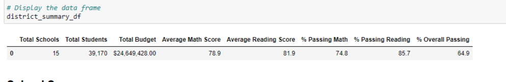
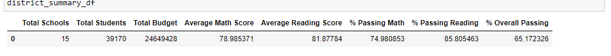
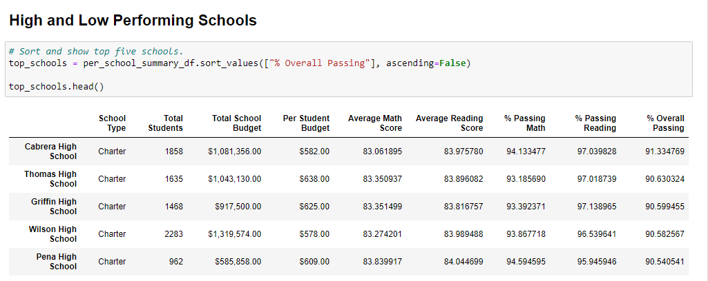
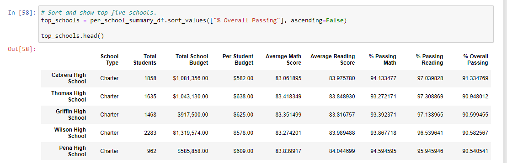

# Overview of School_District_Analysis
The purpose of this analysis is to prepare standardized test data for analysis to provide insights about performance trends and patterns at the school and district level. These insights will help the school board make decisions regarding school budgets and priorities. After the initial analysis was completed, it was discovered that there was evidence of academic dishonesty in the reporting of a school's ninth grade reading and math scores. I then did another analysis, replacing the suspected dishonest scores, and compared the results to show how the changes affected the overall analysis.

## Results
*How was the district summary affected?*
The disctrict summary was hardly affected being that math, reading, and overall passing percentages went down by a tenth of a percent.

*How was the school summary affected?*
The school summary shows that only Thomas High School was affected due to their school being the only suspected of academic dishonesty. With that said, the school's average reading and math score were affected by less than a point and the percentage of students passing math, reading, or both were affected by less than one percent.

*How does replacing the ninth graders’ math and reading scores affect Thomas High School’s performance relative to the other schools?*
As stated above, the analysis shows that the scores and percentages of students passing is affected by less than one percent. Thomas High School is still the second top performing school in the district.

*How does replacing the ninth-grade scores affect math and reading scores by grade, scores by spending size, scores by school size, and scores by school type?*
The scores were slightly affected in some of the areas but by less than a percent which is not significant.

## Summary
The district summary, school summary, scores by grade, and top performing schools were all slightly affected by the replacing of the scores suspected of academic dishonesty. The analysis shows that these were all either affect by less than one point or one percentage point which was not significant enough the change the results of the original analysis.

